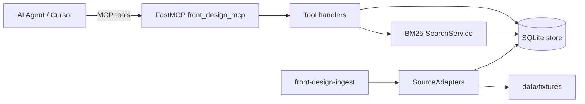

# front-design-mcp

Local-first **FastMCP** server that gives AI agents specialized frontend UI/UX intelligence: discover components and patterns, search documentation chunks, compare libraries, and recommend stacks — always with citations and a clear split between **facts** and **inferences**.

## Value proposition

| Need | How this MCP helps |
|------|-------------------|
| Pick UI primitives for React/Next | Indexed shadcn, Radix, Magic UI (+ curated patterns) |
| Motion / scroll storytelling | Motion + GSAP metadata, reduced-motion notes when known |
| Agent-safe recommendations | Provenance, licenses, no unverified compatibility claims in facts |
| Offline / private | SQLite + committed fixtures; network ingest off by default |

## Architecture



## Quick start

```bash
uv sync --all-extras
uv run front-design-ingest --offline
uv run front-design-mcp
# equivalent:
uv run python -m front_design_mcp
```

### Cursor MCP config

Copy [configs/cursor.mcp.json.example](configs/cursor.mcp.json.example) into your Cursor MCP settings and replace `/absolute/path/to/front-design-mcp`:

```json
{
  "mcpServers": {
    "front_design_mcp": {
      "command": "uv",
      "args": [
        "run",
        "--directory",
        "/absolute/path/to/front-design-mcp",
        "python",
        "-m",
        "front_design_mcp"
      ],
      "env": {
        "FRONT_DESIGN_LOG_LEVEL": "INFO",
        "FRONT_DESIGN_ENABLE_NETWORK_INGEST": "false",
        "FRONT_DESIGN_EMBEDDING_PROVIDER": "none"
      }
    }
  }
}
```

Claude Desktop example: [configs/claude-desktop.mcp.json.example](configs/claude-desktop.mcp.json.example).

## Tools

| Tool | Purpose |
|------|---------|
| `front_design_ping` | Health / version / indexed count |
| `discover_frontend_resources` | Browse/filter catalog |
| `search_frontend_knowledge` | BM25 over doc chunks |
| `get_resource_details` | Full resource + chunks (`id`) |
| `compare_frontend_options` | Compare by `options` (ids/names); facts vs inferences |
| `recommend_frontend_stack` | Stack suggestion from requirements |
| `find_components` | Intent → components/patterns |
| `find_animation_patterns` | Motion patterns + a11y/cost notes |
| `build_frontend_brief` | Implementation brief |

Also: resource `front-design://sources`, template `front-design://resource/{id}`, prompt `frontend_implementation_brief`.

## Source licenses

| Source | License note |
|--------|----------------|
| Motion | MIT |
| Magic UI | MIT |
| shadcn/ui | MIT |
| Radix Primitives | MIT |
| GSAP | Standard No Charge — **metadata only**, not redistributable |
| Curated patterns | Internal MIT metadata linking to upstream docs |

This project is **Apache-2.0** ([LICENSE](LICENSE)). Upstream catalogs keep their own licenses.

## Docs

| Document | Purpose |
|----------|---------|
| [docs/research.md](docs/research.md) | Research notes & source facts |
| [docs/orchestration.md](docs/orchestration.md) | Package plan, model IDs, acceptance |
| [docs/evaluation.md](docs/evaluation.md) | Offline RAG/tool evaluation |
| [docs/adapters.md](docs/adapters.md) | How to add a SourceAdapter |
| [docs/github.md](docs/github.md) | Suggested GitHub description/topics |
| [docs/adr/](docs/adr/) | Architecture Decision Records |
| [CONTRIBUTING.md](CONTRIBUTING.md) | Dev setup & PR guidelines |
| [SECURITY.md](SECURITY.md) | Vulnerability reporting |

## Quality / CI

```bash
uv run ruff check src tests scripts
uv run mypy src/front_design_mcp
uv run pytest -q
uv run python scripts/evaluate_rag.py
uv run python scripts/mcp_smoke.py
```

GitHub Actions: [`.github/workflows/ci.yml`](.github/workflows/ci.yml) (contents: read).

## mcp-builder skill

Scaffolding and eval practices follow Anthropic’s **mcp-builder** agent skill (vendored under `.agents/skills/mcp-builder/`). Do not edit that tree or `skills-lock.json` in routine PRs.

## Dockerfile

No production Dockerfile in v0.1 — local `uv` + CI is the supported path. A Docker image may be added after a verified `docker build`.
